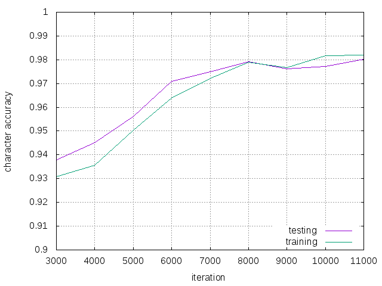

This repository contains images for training and testing an [OCRopus](https://github.com/tmbdev/ocropy) model for Cyrillic letters.

As of today, the training data does not contain enough examples for every Cyrillic letter. Some letters might be missing completely.

The model can be trained using this command:

	ocropus-rtrain -c codec.txt -F 1000 -o cyrillic training/*.bin.png

I have trained an initial model `cyrillic-00009000.pyrnn.gz` which can be found in the repository. You can see the training progress of the model in this diagram: 

## sources

The snippets come from these sources:

- [Введение в археологию. Часть I (Жебелёв) page 6](https://ru.wikisource.org/wiki/%D0%A1%D1%82%D1%80%D0%B0%D0%BD%D0%B8%D1%86%D0%B0:%D0%92%D0%B2%D0%B5%D0%B4%D0%B5%D0%BD%D0%B8%D0%B5_%D0%B2_%D0%B0%D1%80%D1%85%D0%B5%D0%BE%D0%BB%D0%BE%D0%B3%D0%B8%D1%8E._%D0%A7%D0%B0%D1%81%D1%82%D1%8C_1_(%D0%96%D0%B5%D0%B1%D0%B5%D0%BB%D1%91%D0%B2,_1923).pdf/14) 

## extending the training material

There is a folder `raw` that contains additional images without ground truth data. If you can read Russian or like to fiddle about the Cyrillic letter (the most I can do) you are invidet to complete the ground truth data:

Generate an initial model as described above. Use that model for a prediction and create the HTML file for correction:

	ocropus-rpred -m cyrillic-00003000.pyrnn.gz raw/*.bin.png
	ocropus-gtedit html raw/*.bin.png

Edit the file `correction.html ` and save the result. Beware that some browsers do not save the content of the input fields. Test it with a single line to avoid disappointment! I that case you can use the *inspect* funciton you browser and copy the HTML code into a file using a text editor.

After the HTML file containing the ground truth has been edited it needs to be processed by OCRopus:

	ocropus-gtedit extract correction.html

If you like you can split the resulting `bin.png` and `gt.txt` files into `training` and `testing` folders. Or you simple leave them in the `raw` folder and I will be the distribution.

Additional scans containing Cyrillic letters are also warmly welcome!

